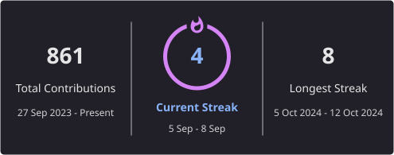

  <table border="0" cellspacing="0" cellpadding="10">
    <tr>
      <td valign="center">
        
      </td>
      <td valign="center">
        
      </td>
    </tr>
  </table>

   

  
  

 

👋🏻 Hi! My full name is **Irfan Zharauri Nanda Sudiyanto**, feel free to call me **Irfan** or **Zara**.
A fresh graduate from Telkom University's Information Technology program, now actively working in IT Infrastructure, Backend Development, and Cybersecurity.

🛠️ My day-to-day revolves around servers, systems, and making sure everything runs securely and efficiently, from VPS setup and network configuration to building internal tools and automation systems.

🌐 My background in web development taught me to think systematically and care about user experience. Now I apply that mindset to a broader scope: designing digital infrastructure that's robust, secure, and scalable.

🔐 Cybersecurity is an area I'm deepening. Understanding not just how to defend, but how systems are architected to be resilient, how attacks happen, and how to respond effectively when incidents occur.

## 🚀 Selected Work

| Project | What I Built | Stack |
|---------|--------------|-------|
| [**whatsapp-telegram-bot**](https://github.com/tutupharirabu/whatsapp-telegram-bot) | WhatsApp & Telegram auto messenger for GCAF 2026 — automated multi-platform messaging pipeline with bulk send, number verification, and a FastAPI dashboard. | Python · Telethon · Selenium · FastAPI · SQLite · HTMX |
| [**pdf-gate**](https://github.com/tutupharirabu/pdf-gate) | Dual-layer PDF document validator for Indonesian formal documents — 8 built-in schemas, auto schema generation, and zero-trust security. | Node.js · pdfjs-dist · Tesseract.js · Jest · Express |
| [**NyuwunSewu · ShieldPDP**](https://github.com/tutupharirabu/NyuwunSewu-ShieldPDP-Project) | Compliance-driven security validation & privacy risk management platform — UU PDP/OWASP ASVS mapping, PII detection, API scanning, and Phantom AI agent (Hermes) for interactive vulnerability exploration. | FastAPI · React · TypeScript · PostgreSQL · Redis · Celery · Hermes |
| [**MatchaKo**](https://matchakoofficial.com) | Official landing page for Indonesia's street matcha brand — menu showcase, partnership packages, ROI calculator, and WhatsApp consultation funnel. | Astro 5 · Preact · Tailwind · Cloudflare D1 · Drizzle |
| [**Project-BTP**](https://github.com/tutupharirabu/Project-BTP) · [Live](https://spacerentbtp.com) | Room & equipment rental management system for Bandung Techno Park — booking, rental, and administration for admins, staff, and tenants. | Laravel 10 · Blade · Bootstrap · PostgreSQL · Redis |

## 📚 Currently Learning

- IT Infrastructure & Cloud Architecture
- Cybersecurity & GRC (ISO 27001, TOGAF)
- Backend Systems & API Design
- AI/LLM Integration & Agentic Systems

## ⚙️ Languages, Tools & Frameworks I Use

   
   
   
   
   

## 🏆 GitHub Trophies

  

## 🐍 My Contributions This Year

<picture>
  <source media="(prefers-reduced-motion: reduce)" srcset="https://raw.githubusercontent.com/tutupharirabu/tutupharirabu/output/github-contribution-grid-snake-static.svg">
  <source media="(prefers-color-scheme: dark)" srcset="https://raw.githubusercontent.com/tutupharirabu/tutupharirabu/output/github-contribution-grid-snake-dark.svg">
  <source media="(prefers-color-scheme: light)" srcset="https://raw.githubusercontent.com/tutupharirabu/tutupharirabu/output/github-contribution-grid-snake.svg">
  
</picture>

## 📈 Recent Public Activity

  

© 2026 - Irfan Zharauri Nanda Sudiyanto

